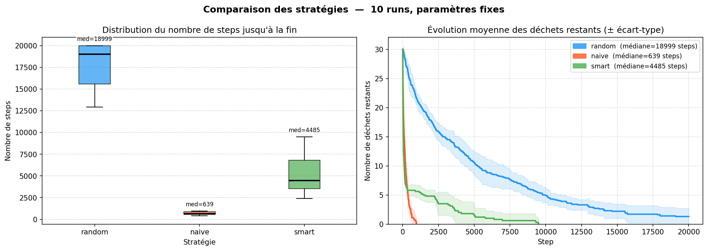
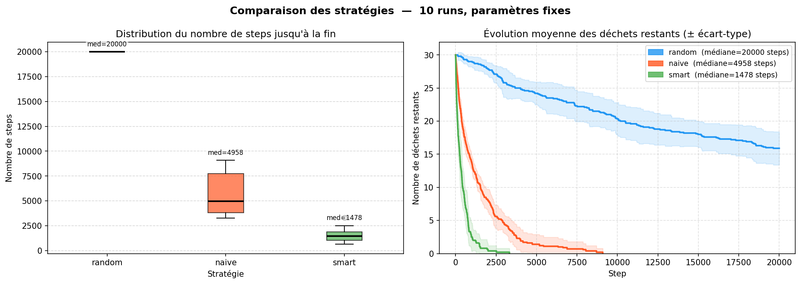

# Projet SMA - Collecte et Tri de Déchets Radioactifs

**Date de création :** 16/03/2026  
**Membres du groupe (Groupe 6) :** 
- Nicolas Charronnière
- Paul Guimbert


## Description du Projet
Ce projet implémente un Système Multi-Agents (SMA) développé en Python avec la bibliothèque **Mesa**. 
Il simule un environnement divisé en trois zones de radioactivité croissante où des robots spécialisés doivent coopérer indirectement pour nettoyer l'espace. Les robots ramassent des déchets, les fusionnent pour les transformer, et les font transiter de zone en zone jusqu'à leur évacuation finale.


## Prérequis et Installation

Assurez-vous d'avoir Python installé sur votre machine. Utiliser le fichier `requirements.txt` pour installer l'ensemble des libraires nécessaires au bon fonctionnement du projet.

```bash
pip install -r requirements.txt
```

## Instructions d'exécution

Le projet utilise **Solara** pour le rendu de l'interface visuelle et du dashboard. Pour lancer le serveur web contenant la simulation :

```bash
solara run server.py
```
Une fois la commande lancée, un lien local (généralement `http://localhost:8765`) s'affichera dans votre terminal. Ouvrez ce lien dans votre navigateur web pour interagir avec la simulation.

##  Choix Conceptuels et Architecture

### 1. L'Environnement
L'espace est une grille bidimensionnelle non torique (`MultiGrid`) divisée verticalement en trois zones :
- **Zone 1 (Verte)** : Faible radioactivité.
- **Zone 2 (Jaune)** : Radioactivité moyenne.
- **Zone 3 (Rouge)** : Forte radioactivité, comportant une zone d'évacuation définitive (`WasteDisposalZone`).

### 2. Les Agents
Nous avons implémenté trois types de robots, chacun assigné à un niveau de déchet spécifique :
- **GreenAgent** : Ramasse les déchets verts, en assemble 2 pour créer un déchet jaune, et le dépose à la frontière de la Zone 2.
- **YellowAgent** : Ramasse les déchets jaunes, en assemble 2 pour créer un déchet rouge, et le dépose à la frontière de la Zone 3.
- **RedAgent** : Ramasse les déchets rouges et les achemine jusqu'aux `WasteDisposalZone` situées tout à droite de la grille.

### 3. Architecture Interne des Robots
Les robots suivent un cycle d'action strict basé sur la séparation entre la perception, la base de connaissances et la délibération :
1. **Perception (`get_percepts`)** : L'environnement renvoie les données de la case actuelle et des cases adjacentes au robot.
2. **Mise à jour (`update`)** : Le robot met à jour sa base de connaissances stricte (`self.knowledge`) avec les nouvelles perceptions sans manipuler directement le modèle.
3. **Délibération (`deliberate`)** : Basé sur sa base de connaissances, le robot choisit une action parmi : `move`, `pick`, `put`, ou `transform`. Notre objectif est d'implémenter [différentes stratégies](#stratégies) de délibération de complexité croissante.
4. **Action (`do`)** : L'environnement résout l'action demandée par l'agent si elle est possible, applique les conséquences physiques (ex: retrait d'un objet de la grille) et renvoie les nouvelles perceptions.

### 4. Script de comparaison des stratégies
Le fichier `compare_strategies.py` permet d'éxecuter un certain nombre de run complet avec les différentes stratégies souhaités et de mesurer des statistiques permettant de comparer l'efficacité de ces stratégeis. Le critère principal d'efficacité que nous utilisons et le nombre de steps nécessaire pour terminer le ramassage.

## Stratégies
Nous avons implémentés différentes stratégies de complexité croissante, afin d'essayer d'optimiser le temps de collecte de l'ensemble des déchets.
### Stratégie aléatoire
Les actions sont choisies complètement aléatoirement. Cette stratégie sert de baseline pour nos autres implémentations.
### Stratégie naive
Notre première stratégie : Les actions sont choisies selon des règles fixes, et les déplacements sont effectuées de manière semi-aléatoire en fonction de l'invenatire de l'agent :
Pour les agents verts et jaune:
- Si un agent possède deux déchets de sont types, il `transform`
- Sinon, s'il possède un déchets de type supérieur à lui et que la case à sa droite est de niveau supérieur, il `put`
- Sinon, s'il , s'il possède un déchets de type supérieur à lui, il `move` il move vers la droite.
- Sinon, s'il est sur un déchet de son niveau, il `pick`.
- Sinon, il `move` dans une des qatres directions de manière aléatoire (uniformement).
Après nos premiers essais, nous avons dû rajouter une faible probabilité de lâcher le déchet pour les agents vert et jaune, afin de ne pas se retrouver dans des deadlocks où chaque agent possède un déchet dans son inventaire. 

Pour le robot rouge, la plupart des règles sont similaires:
- Si l'agent possède un déchet rouge et qu'il est sur la zone de dépot de déchets, il `put`.
- Si l'agent possède un déchet rouge et qu'il n'est pas sur l'extremité droite de la grille, il `move `vers la droite
- Si l'agent possède un déchet rouge et qu'il est l'extremité droite de la grille, il `move ` aléatoirement vers le haut ou le bas (uniforme).
- Sinon, s'il est sur un déchet rouge, il `pick`.
- Sinon, il `move` dans une des quatres directions de manière aléatoire (uniformement).

En vérifiant bien dans cet ordre les actions possibles, cela évite globalement de demander des actions impossibles tel que récupérer trop de déchets en même temps. Cela converge bien vers le ramassage de tout les déchets.

### Stratégie intelligente
Cette stratégie ajoute une file d'actions à l'agent. Lorsqu'il est en situation de recherche d'un déchet, s'il a dans sa connaissance la position d'un déchet, il va se déplacer afin de le rejoindre le plus rapidement possible (BFS). Si sur son chemin il passe directement ou juste à coté d'un autre déchet, il change de target pour récupérer ce déchet (qui est plus proche et pour lequel il est sur qu'il est encore présent).

### Stratégie communication


## Résultats
Grâce au dashboard dynamique, on observe bien la courbe de déchets verts et jaunes diminuer au profit de déchets de niveaux supérieurs, jusqu'à l'évacuation complète par les agents rouges. L'architecture développée prévient les erreurs de collisions ou de triche : un agent ne se déplace ou ne ramasse un objet que si l'environnement valide la faisabilité de son intention.

Certains déchets verts et jaunes peuvent rester bloqués dans les inventaires des robots si plus aucun déchet du même type n'est au sol. Pour gérer ce problème, nous avons ajouté une probabilité d'abandonner (`put`) l'objet transporté au lieu de se déplacer lorsqu'un agent possède un seul objet. La condition de terminaison a été adaptée : le ramassage est terminé s'il reste strictement moins de 2 déchets verts, moins de 2 déchets jaunes, et aucun déchet rouge.

### Comparaison : Scénario à forte densité (10 agents par type)
Nous avons comparé nos stratégies sur 10 épisodes, avec 10 agents et 10 déchets de chaque type, et un nombre de steps limité à 20 000 :



Toutes nos stratégies surpassent largement l'aléatoire. Cependant, un résultat contre-intuitif émerge : la stratégie **naïve** (~639 steps) domine largement la stratégie **intelligente** (~4485 steps). 

**Analyse : Le paradoxe de la mémoire sans communication.**
Dans un espace restreint avec beaucoup d'agents, si un déchet est repéré, plusieurs agents "smart" vont le mémoriser et calculer un chemin (BFS) vers lui. Le premier arrivé le ramasse, tandis que les autres continuent de converger vers une case vide (chasse aux fantômes), perdant un temps précieux. À l'inverse, le déplacement semi-aléatoire continu de la stratégie naïve balaie l'espace beaucoup plus efficacement.

### Comparaison : Scénario à faible densité (1 agent par type)
Pour confirmer cette intuition, nous avons relancé l'expérience avec un seul agent de chaque couleur :



Cette fois-ci, l'absence de compétition annule le problème des "fantômes". La mémoire devient 100% fiable. On observe que la stratégie **intelligente** (~1478 steps) converge beaucoup plus efficacement et de manière beaucoup plus stable que la stratégie **naïve** (~4958 steps).

**Fonctionnalités achevées :**
- **Génération procédurale** de la carte avec répartition automatique des trois zones de radioactivité et de la zone de dépôt.
- **Architecture de délibération modulaire** permettant de basculer facilement entre nos différentes stratégies (`random`, `naïve`, `smart`).
- **Mécaniques physiques opérationnelles** : ramassage, transformation dans l'inventaire (fusion de déchets de même niveau) et dépôt à la frontière de la zone suivante.
- **Interface visuelle interactive** avec `Solara` et `Mesa` :
  - Dashboard de contrôle (sliders) pour paramétrer la taille des zones, le nombre d'agents et la quantité de déchets initiaux.
  - Rendu en temps réel de la grille spatiale et du comportement des agents.
  - Collecte de données (`DataCollector`) et affichage de graphiques dynamiques suivant la quantité de déchets restants.
- **Résolution des interblocages (deadlocks)** : ajout d'une probabilité d'abandon stochastique (`epsilon`) pour les agents bloqués avec un seul objet, et mise à jour dynamique des conditions de fin de simulation.

### Pistes à explorer :
L'implémentation de la stratégie "smart" a mis en évidence les limites d'une mémoire individuelle sans partage d'informations. Nos prochaines étapes se concentrent sur la communication :
- *Stratégie de communication Pair-à-Pair (1 à 1) :* Permettre à deux agents du même type se croisant d'échanger des informations (ex: se donner un déchet pour forcer une transformation).
- *Stratégie de communication globale (Blackboard) :* Mettre en place un système où les agents partagent une base de connaissances commune (si un agent ramasse un déchet, il disparaît de la mémoire de tous les autres), ce qui devrait supprimer totalement le phénomène de "chasse aux fantômes" observé.